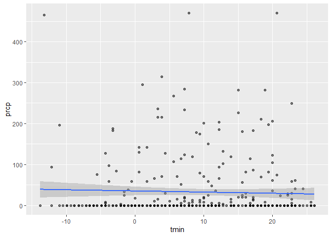

P8105_hw6_jjam2530
================
Jenna Mohammed
2023-11-28

``` r
library(readr)
```

    ## Warning: package 'readr' was built under R version 4.1.3

``` r
library(tidyverse)
```

    ## Warning: package 'tidyverse' was built under R version 4.1.3

    ## Warning: package 'tibble' was built under R version 4.1.3

    ## Warning: package 'tidyr' was built under R version 4.1.3

    ## Warning: package 'purrr' was built under R version 4.1.3

    ## Warning: package 'dplyr' was built under R version 4.1.3

    ## Warning: package 'stringr' was built under R version 4.1.3

    ## Warning: package 'forcats' was built under R version 4.1.3

    ## Warning: package 'lubridate' was built under R version 4.1.3

    ## -- Attaching core tidyverse packages ------------------------ tidyverse 2.0.0 --
    ## v dplyr     1.1.2     v purrr     1.0.1
    ## v forcats   1.0.0     v stringr   1.5.0
    ## v ggplot2   3.4.3     v tibble    3.2.1
    ## v lubridate 1.9.2     v tidyr     1.3.0
    ## -- Conflicts ------------------------------------------ tidyverse_conflicts() --
    ## x dplyr::filter() masks stats::filter()
    ## x dplyr::lag()    masks stats::lag()
    ## i Use the conflicted package (<http://conflicted.r-lib.org/>) to force all conflicts to become errors

``` r
library(p8105.datasets)
```

# Problem 1

``` r
urlfile = "https://raw.githubusercontent.com/washingtonpost/data-homicides/master/homicide-data.csv"

data <- read_csv(url(urlfile))
```

    ## Rows: 52179 Columns: 12
    ## -- Column specification --------------------------------------------------------
    ## Delimiter: ","
    ## chr (9): uid, victim_last, victim_first, victim_race, victim_age, victim_sex...
    ## dbl (3): reported_date, lat, lon
    ## 
    ## i Use `spec()` to retrieve the full column specification for this data.
    ## i Specify the column types or set `show_col_types = FALSE` to quiet this message.

# Problem 2

Loading in the data for problem 2

``` r
weather_df = 
  rnoaa::meteo_pull_monitors(
    c("USW00094728"),
    var = c("PRCP", "TMIN", "TMAX"), 
    date_min = "2022-01-01",
    date_max = "2022-12-31") |>
  mutate(
    name = recode(id, USW00094728 = "CentralPark_NY"),
    tmin = tmin / 10,
    tmax = tmax / 10) |>
  select(name, id, everything())
```

    ## using cached file: C:\Users\jenna\AppData\Local/R/cache/R/rnoaa/noaa_ghcnd/USW00094728.dly

    ## date created (size, mb): 2023-09-28 10:12:31 (8.541)

    ## file min/max dates: 1869-01-01 / 2023-09-30

``` r
view(weather_df)
```

function to generate bootstrap samples

``` r
boot_sample = function(weather_df) {
  sample_frac(weather_df, replace = TRUE)
  fit <- lm(tmax ~ tmin + prcp, data = weather_df)
}
```

``` r
boot_sample(weather_df) |> 
  ggplot(aes(x = tmin, y = prcp)) + 
  geom_point(alpha = .5) +
  stat_smooth(method = "lm")
```

    ## `geom_smooth()` using formula = 'y ~ x'

<!-- -->

stating the number of bootstrap samples

``` r
 boot_sample <- 5000
```

Drawing 5000 boostrap samples

``` r
#boot_straps = 
#  tibble(strap_number = 1:5000) |> 
#  mutate(
#    strap_sample = map(strap_number, \(i) boot_sample(df = weather_df))
#  )

#boot_straps
```
