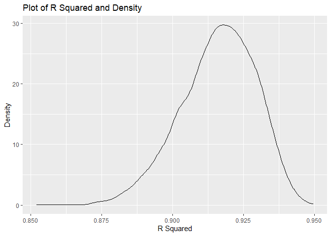
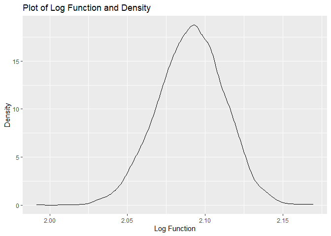
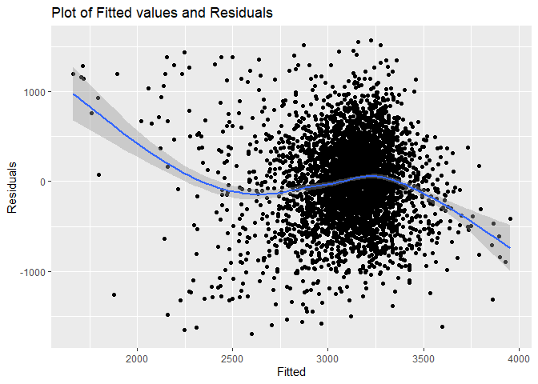
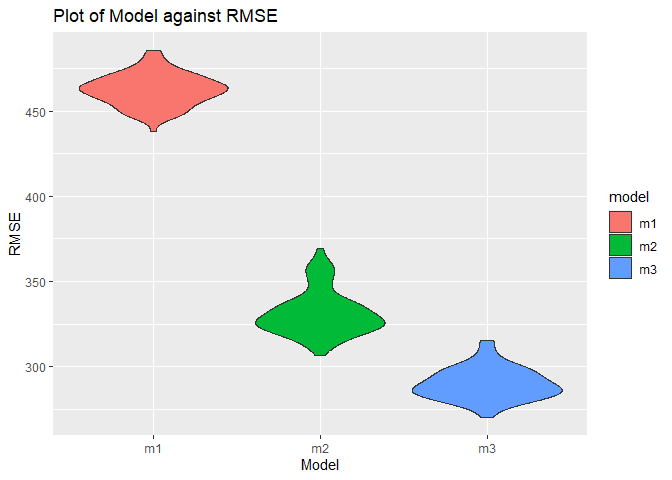

P8105_hw6_jam2530
================
Jenna Mohammed
2023-11-28

``` r
library(readr)
library(tidyverse)
library(modelr)
library(p8105.datasets)
```

# Problem 1

``` r
urlfile = "https://raw.githubusercontent.com/washingtonpost/data-homicides/master/homicide-data.csv"

data <- read_csv(url(urlfile))
```

    ## Rows: 52179 Columns: 12
    ## -- Column specification --------------------------------------------------------
    ## Delimiter: ","
    ## chr (9): uid, victim_last, victim_first, victim_race, victim_age, victim_sex...
    ## dbl (3): reported_date, lat, lon
    ## 
    ## i Use `spec()` to retrieve the full column specification for this data.
    ## i Specify the column types or set `show_col_types = FALSE` to quiet this message.

# Problem 2

#### Loading in and cleaning data

``` r
weather_df = 
  rnoaa::meteo_pull_monitors(
    c("USW00094728"),
    var = c("PRCP", "TMIN", "TMAX"), 
    date_min = "2022-01-01",
    date_max = "2022-12-31") |>
  mutate(
    name = recode(id, USW00094728 = "CentralPark_NY"),
    tmin = tmin / 10,
    tmax = tmax / 10) |>
  select(name, id, everything())
```

    ## using cached file: C:\Users\jenna\AppData\Local/R/cache/R/rnoaa/noaa_ghcnd/USW00094728.dly

    ## date created (size, mb): 2023-09-28 10:12:31 (8.541)

    ## file min/max dates: 1869-01-01 / 2023-09-30

``` r
view(weather_df)
```

#### Fitting a regression model

``` r
fit <- lm(tmax ~ tmin + prcp, data = weather_df) |>
  broom::tidy() |> 
  knitr::kable(digits = 3)
```

#### Creating function for bootstrap

``` r
boot_sample = function(weather_df) {
  sample_frac(weather_df, replace = TRUE)
}
```

#### Creating Estimate and Plot for R^2

``` r
r_squared = 
  weather_df |>
  bootstrap(n = 5000) |>
  mutate(
    models = map(.x = strap, ~lm(tmax ~ tmin, data = .x)),
    results = map(models, broom::glance)) |>
  unnest(results)

view(r_squared)

r_squared_plot <- r_squared |>
  ggplot(aes(x = r.squared)) + 
  geom_density() +
  labs( 
    x = "R Squared",
    y = "?",
    title = "?")

print(r_squared_plot)
```

<!-- -->

#### Performing a 95% Confidence Interval for R^2

``` r
r_squared |>
  summarize(
    lower_limit = quantile(r.squared, 0.025), 
    upper_limit = quantile(r.squared, 0.975)) |>
  knitr::kable(digits = 3)
```

| lower_limit | upper_limit |
|------------:|------------:|
|       0.887 |       0.938 |

The 95% confidence interval for R^2 is (0.887, 0.939)

#### Creating estimate for log(beta_0 \* beta_1)

``` r
log_estimate= 
  weather_df |>
  modelr::bootstrap(n = 5000) |>
  mutate(
    models = map(strap, ~lm(tmax ~ tmin, data = .x)),
    results = map(models, broom::tidy)
  ) |>
  select(-strap, -models) |>
  unnest(results) |>
  select(.id, term, estimate) |>
  pivot_wider(
    names_from = "term", 
    values_from = "estimate"
  ) |>
  mutate(
    log_function = log(`(Intercept)`*tmin)
  ) 

log_plot<- log_estimate |>
  ggplot(aes(x = log_function)) + 
  geom_density() +
  labs( 
    x = "Log Function",
    y = "?",
    title = "?")

print(log_plot)
```

<!-- -->

#### Performing a 95% CI for log

``` r
log_estimate |>
  summarize(
    lower_limit = quantile(log_function, 0.025), 
    upper_limit = quantile(log_function, 0.975)) |>
  knitr::kable(digits = 3)
```

| lower_limit | upper_limit |
|------------:|------------:|
|       2.049 |       2.131 |

# Problem 3

#### Reading in and cleaning the data

``` r
birthweight_df = read_csv("./birthweight.csv")
```

    ## Rows: 4342 Columns: 20
    ## -- Column specification --------------------------------------------------------
    ## Delimiter: ","
    ## dbl (20): babysex, bhead, blength, bwt, delwt, fincome, frace, gaweeks, malf...
    ## 
    ## i Use `spec()` to retrieve the full column specification for this data.
    ## i Specify the column types or set `show_col_types = FALSE` to quiet this message.

``` r
birthweight_df |>
  janitor::clean_names() |>
  drop_na() |>
  mutate(
    babysex = factor(babysex, labels = c("male", "female")
  ), 
   frace = factor(frace, labels = c("White", "Black", "Asian", "Puerto Rican", "Other")),
   mrace = factor(mrace, labels = c("White", "Black", "Asian", "Puerto Rican")
  )) 
```

    ## # A tibble: 4,342 x 20
    ##    babysex bhead blength   bwt delwt fincome frace gaweeks malform menarche
    ##    <fct>   <dbl>   <dbl> <dbl> <dbl>   <dbl> <fct>   <dbl>   <dbl>    <dbl>
    ##  1 female     34      51  3629   177      35 White    39.9       0       13
    ##  2 male       34      48  3062   156      65 Black    25.9       0       14
    ##  3 female     36      50  3345   148      85 White    39.9       0       12
    ##  4 male       34      52  3062   157      55 White    40         0       14
    ##  5 female     34      52  3374   156       5 White    41.6       0       13
    ##  6 male       33      52  3374   129      55 White    40.7       0       12
    ##  7 female     33      46  2523   126      96 Black    40.3       0       14
    ##  8 female     33      49  2778   140       5 White    37.4       0       12
    ##  9 male       36      52  3515   146      85 White    40.3       0       11
    ## 10 male       33      50  3459   169      75 Black    40.7       0       12
    ## # i 4,332 more rows
    ## # i 10 more variables: mheight <dbl>, momage <dbl>, mrace <fct>, parity <dbl>,
    ## #   pnumlbw <dbl>, pnumsga <dbl>, ppbmi <dbl>, ppwt <dbl>, smoken <dbl>,
    ## #   wtgain <dbl>

``` r
view(birthweight_df)
```

#### Regression model for birthweight

``` r
regression_model = lm(bwt ~ malform + smoken + gaweeks + babysex , data = birthweight_df)

residual_plot <- birthweight_df |>
  add_predictions(regression_model) |>
  add_residuals(regression_model) |>
  ggplot(aes(x = pred, y = resid)) +
  geom_point() +
  geom_smooth()

print(residual_plot)
```

    ## `geom_smooth()` using method = 'gam' and formula = 'y ~ s(x, bs = "cs")'

<!-- -->

#### Comparing model to other models

- We will create model 2 using `blength` and `gaweeks` as predictors
- We will create model 3 using `bhead`, `blength`, `babysex`, anf their
  interactions as predictors

``` r
 model_2 = lm(bwt ~ blength + gaweeks, data = birthweight_df)

 model_3 = lm(bwt ~ bhead + blength + babysex + bhead*blength + bhead*babysex + blength*babysex, data = birthweight_df)
```

#### Testing the models

``` r
cv_model <- birthweight_df |> 
  crossv_mc( 100) |>
  mutate(
    train = map(train,as_tibble),
    test = map(test,as_tibble)
  )
```

``` r
cv_model =
    cv_model  |>
  mutate(
    m1 = map(train, ~ lm(bwt ~ malform + smoken + gaweeks + babysex , data = .x)),
    m2 = map(train, ~lm(bwt ~ blength + gaweeks,  data = .x)),
    m3 = map(train, ~lm(bwt ~ babysex + blength + bhead + babysex * blength + babysex * bhead + blength * bhead + babysex * blength * bhead, data = .x))
    ) |>
  
  mutate(
    rmse_m1 = map2_dbl(m1, test, ~rmse(model = .x, data = .y)),
    rmse_m2 = map2_dbl(m2, test, ~rmse(model = .x, data = .y)),
    rmse_m3 = map2_dbl(m3, test, ~rmse(model = .x, data = .y)))
```

``` r
cv_model |> 
  select(starts_with("rmse")) |>
  pivot_longer(
    everything(),
    names_to = "model", 
    values_to = "rmse",
    names_prefix = "rmse_") |>
  mutate(model = fct_inorder(model)) |>
  ggplot(aes(x = model, y = rmse, fill = model)) + 
  geom_violin()+
  labs(
    x = "Model",
    y = "RMSE",
    title = "Plot of Model against RMSE"
  )
```

<!-- -->

The plot above shows that model 3 is the preferred model. Compared to
the other two models, model 3 has the lowest RMSE, meaning that is has
the smallest difference between the predicted and actual values
